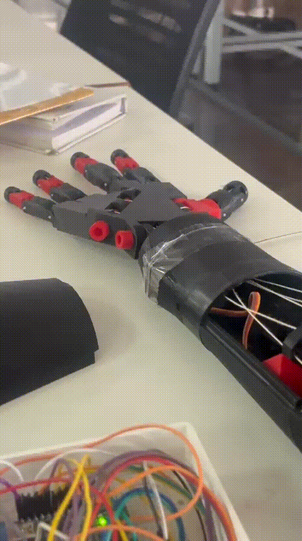
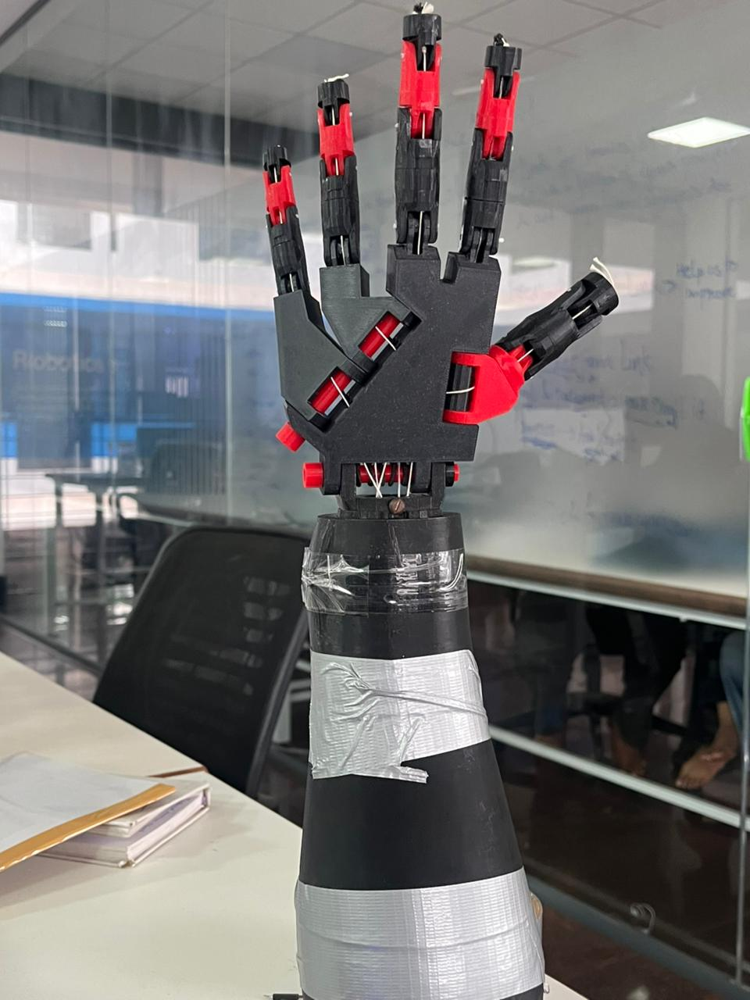
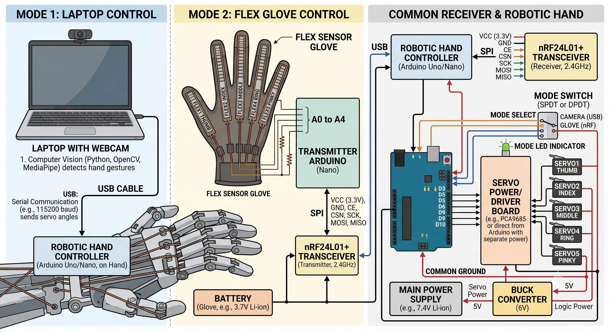
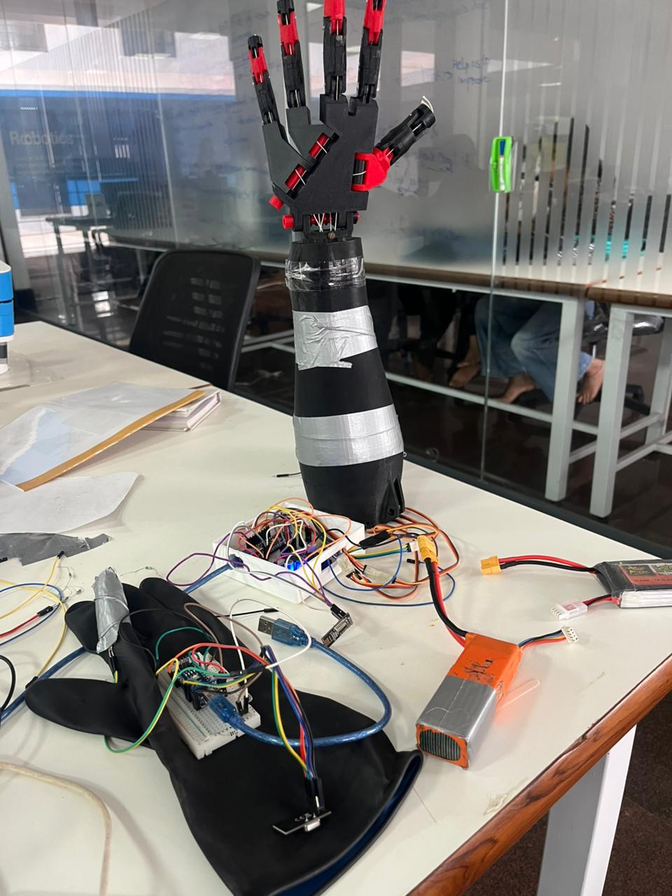
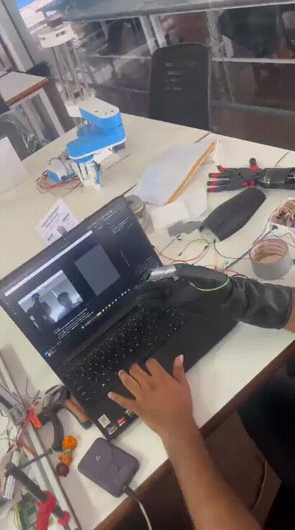

# 🤖 Robotic Hand Controlled Using Dual Modes (Laptop Camera & Flex Sensor Glove)

A robotic hand capable of mimicking human finger movements using **two different control modes**:

1. **Vision-Based Control** using a laptop camera.
2. **Flex Sensor Glove Control** using wireless communication.

The system allows real-time gesture replication and demonstrates human-machine interaction using computer vision, sensors, and embedded systems.


<div align="center">
  
</div>

<br></br>

<div align="center">
  
</div>


---

## 📌 Features

✅ Dual control modes

✅ Real-time finger movement replication

✅ Wireless glove communication

✅ Individual finger control

✅ Computer vision hand tracking

✅ NRF24L01 wireless transceiver communication

✅ Servo-driven robotic hand


---

## 🛠 Hardware Used

### Robotic Hand Side

- Arduino Nano 
- 5 Finger Servo Motors
- NRF24L01 Transceiver Module
- Power Supply

### Glove Side

- Flex Sensors (1 per finger)
- Arduino Nano
- NRF24L01 Transceiver Module
- Glove Mount

### Vision Mode

- Laptop Camera 
- Arduino Nano 
- Servo Controlled Robotic Hand

<div align="center">
  
</div>


---

## 📷 Mode 1: Laptop Camera Control

In this mode:

1. The laptop camera captures the user's hand.
2. Hand landmarks are detected using computer vision.
3. Finger bend angles are calculated.
4. Corresponding commands are sent to the robotic hand.
5. The robotic hand mirrors the detected hand movements.

### Workflow

```text
Laptop Camera
      ↓
Hand Detection
      ↓
Finger Angle Calculation
      ↓
Serial Communication
      ↓
Arduino
      ↓
Servo Motors
      ↓
Robotic Hand Movement
```

---

## 🧤 Mode 2: Flex Sensor Glove Control

In this mode:

1. Flex sensors mounted on a glove detect finger bending.
2. Sensor values are read by an Arduino.
3. Data is transmitted wirelessly using NRF24L01.
4. Receiver Arduino receives the finger positions.
5. Servo motors replicate the hand posture.


<div align="center">
  
</div>


### Workflow

```text
Flex Sensors
      ↓
Arduino Transmitter
      ↓
NRF24L01
      ↓
Wireless Communication
      ↓
NRF24L01 Receiver
      ↓
Arduino Receiver
      ↓
Servo Motors
      ↓
Robotic Hand Movement
```

---

## 📡 Wireless Communication

The glove mode uses:

### NRF24L01 Transceiver Modules

Features:

- 2.4 GHz Communication
- Low Power Consumption
- Fast Data Transfer
- Reliable Wireless Control
- Suitable for Real-Time Robotics Applications

<div align="center">
  
</div>


---

## 🎯 Applications

- Prosthetic Research
- Human-Machine Interfaces
- Robotics Education
- Teleoperation Systems
- Gesture-Controlled Robots
- Rehabilitation Systems
- Assistive Technologies

---

## 🚀 Future Improvements

- Wireless Camera Control
- Mobile App Integration
- Machine Learning Gesture Recognition
- Haptic Feedback Glove
- Bluetooth/Wi-Fi Connectivity
- Additional Degrees of Freedom

---

## 👨‍💻 Technologies Used

- Arduino
- Servo Motors
- Computer Vision
- NRF24L01 Wireless Modules
- Embedded Systems
- Hand Gesture Tracking

---

## 📄 License

This project is intended for educational, research, and robotics learning purposes.

## 👨‍💻 Author

**Pulkit Garg**

Contributions made by Yenepoya university student Shahal Mohammed as well as Sahyadri student Akshay V Shetty.

---